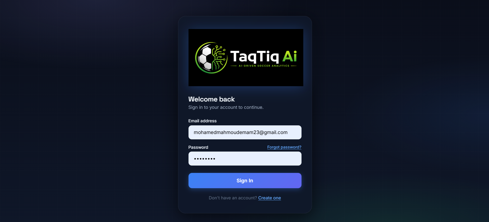
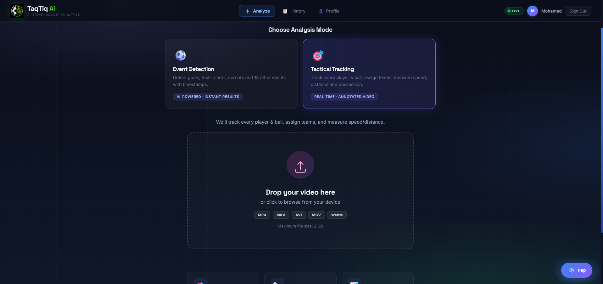
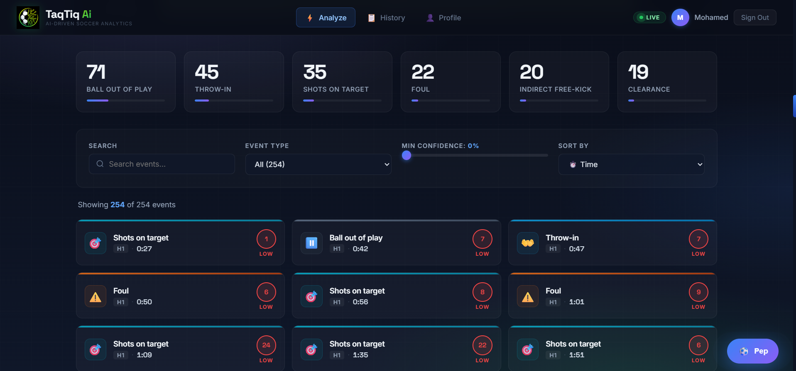
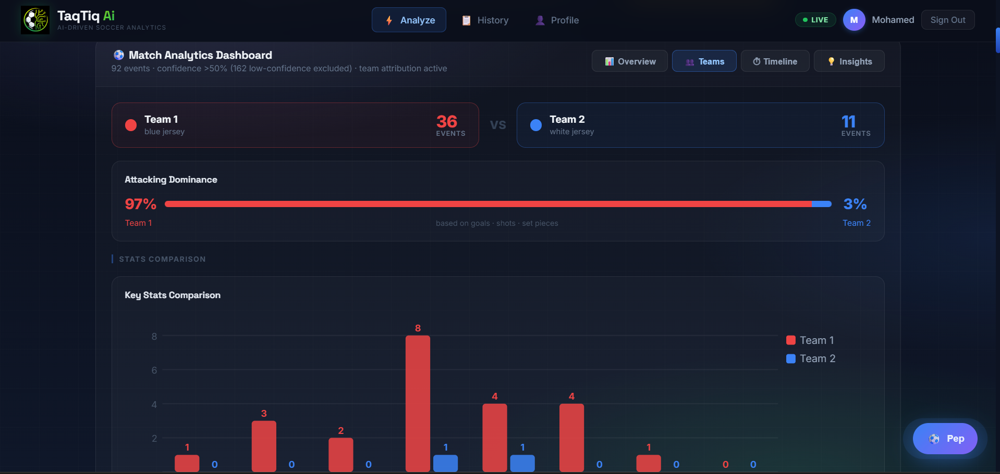
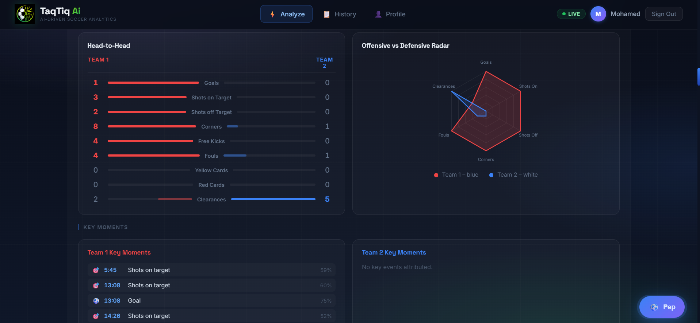
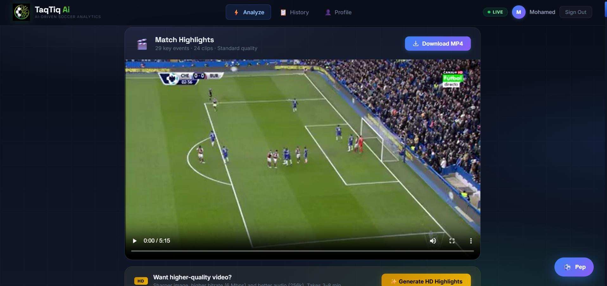
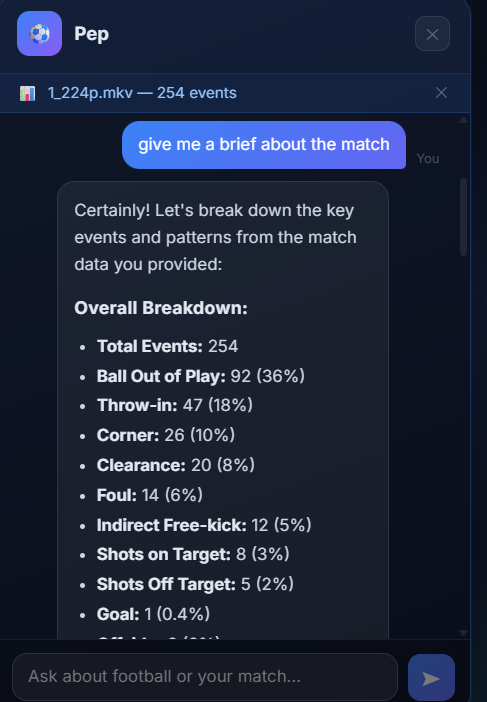
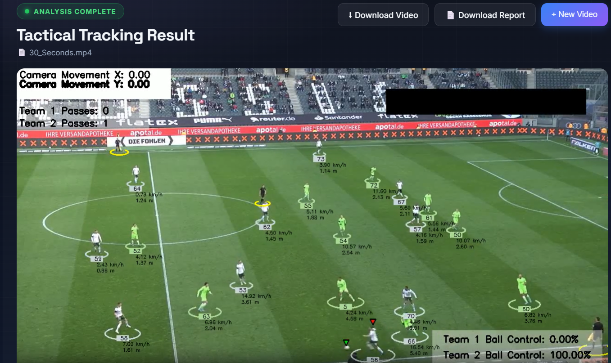
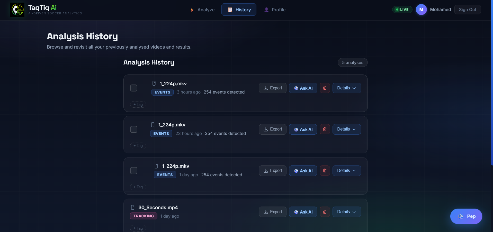
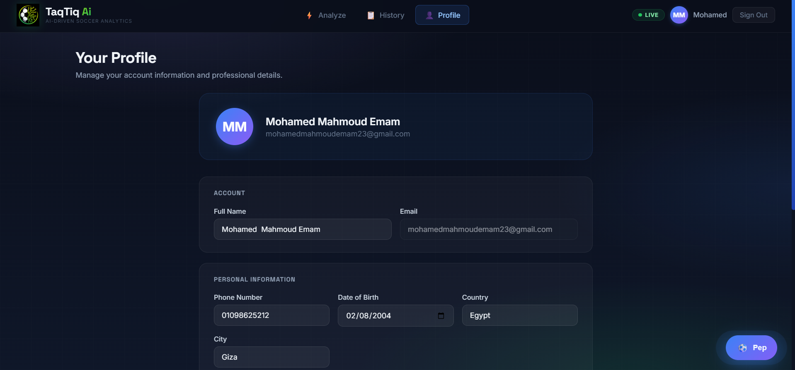

# TaqTiq AI — Soccer Analytics Suite

> AI-powered football match analysis platform: upload a match video and get automatic event detection, player tracking, tactical heatmaps, a highlights reel, and an interactive AI analyst chatbot.

**Live Demo:** https://taq-tiq-ai-grad-project.vercel.app  
**Backend API:** https://huggingface.co/spaces/mohamed7oda/taqtiq-backend

---

## Team Members

| Name | ID | Program |
|---|---|---|
| Mohamed Mahmoud Emam | 202202236 | Data Science & Artificial Intelligence |
| Seif Aboshanab | 202201838 | Data Science & Artificial Intelligence |
| Mohamed Ahmed Bekheet | 202201714 | Data Science & Artificial Intelligence |
| Mostafa Mahmoud Mohamed | 202201962 | Data Science & Artificial Intelligence |

**University:** Zewail City of Science and Technology  
**Faculty:** Faculty of Computer Science  
**Academic Year:** 2025 / 2026

---

## Supervisor

**Dr. Mohamed Maher Ata**

---

## Problem Statement

Football coaches and analysts spend enormous time manually reviewing match footage to extract tactical insights — a process that is slow, costly, and error-prone. There is no affordable, accessible tool that automatically detects match events (goals, fouls, cards, corners, etc.), tracks player movement, and provides tactical statistics from raw video. TaqTiq AI solves this by combining state-of-the-art computer vision models into a single web platform that any coach or analyst can use without technical expertise.

---

## Features

- **Event Detection** — Automatically identifies 17 match event types (goal, foul, yellow/red card, corner, offside, substitution, etc.) from uploaded video using the CALF deep learning model fine-tuned on SoccerNet.
- **Player Tracking** — Tracks all players across every frame using YOLOv8, computes possession percentages, pass counts, and total distance covered per team.
- **Team Attribution** — Classifies detected events by team using jersey color recognition (Groq vision API), and assigns consistent Team 1 (red) / Team 2 (blue) identities throughout the UI.
- **Tactical Heatmaps** — Visualises player and ball positions as heatmaps and pass-flow diagrams per team.
- **Highlights Reel** — Automatically extracts and concatenates key-event clips (goals, cards, shots, etc.) into a single downloadable highlights video.
- **Annotated Video** — Produces a copy of the original video with on-screen event overlay text (e.g. "GOAL!", "YELLOW CARD") burned in via ffmpeg.
- **AI Analyst Chatbot** — Context-aware chatbot powered by Qwen 2.5-7B (via HuggingFace Inference API) that answers questions about the specific match that was just analysed.
- **Analysis History** — Stores every completed analysis per user in a cloud database so results can be revisited, tagged, and annotated with notes.
- **User Accounts** — Full authentication system: register, login, JWT sessions, profile editing, and email-based password reset.
- **Multi-Match Dashboard** — Compare events and statistics across multiple past analyses simultaneously.

---

## System Architecture

```
┌─────────────────────────────────────────────────────────┐
│                     Browser (React SPA)                  │
│  Login/Register → Upload Video → Dashboard → History    │
└──────────────────────────┬──────────────────────────────┘
                           │  REST API  (JWT)
┌──────────────────────────▼──────────────────────────────┐
│              Flask Backend  (HuggingFace Spaces)         │
│                                                          │
│  ┌─────────────────┐   ┌─────────────────────────────┐  │
│  │ InferenceEngine  │   │      TrackingEngine          │  │
│  │ (CALF model)    │   │  (YOLOv8 + supervision)      │  │
│  └────────┬────────┘   └──────────────┬──────────────┘  │
│           │ events JSON               │ tracked video    │
│  ┌────────▼────────────────────────────▼──────────────┐  │
│  │             team_attributor  (Groq vision)         │  │
│  └────────────────────────┬───────────────────────────┘  │
│                           │                              │
│  ┌────────────────────────▼───────────────────────────┐  │
│  │  ffmpeg  ─  highlights.mp4  /  annotated.mp4       │  │
│  └────────────────────────────────────────────────────┘  │
│                                                          │
│  ┌─────────────────────────────────────────────────────┐  │
│  │  HuggingFace Inference API  (Qwen 2.5-7B — chat)   │  │
│  └─────────────────────────────────────────────────────┘  │
└──────────────────────────┬──────────────────────────────┘
                           │ psycopg2
┌──────────────────────────▼──────────────────────────────┐
│            Neon PostgreSQL  (cloud database)             │
│  Users · UserProfiles · AnalysisHistory · AnalysisTags  │
│  MatchNotes · PasswordResetTokens                       │
└─────────────────────────────────────────────────────────┘
```

Model files (~400 MB total) are stored on HuggingFace model hub (`mohamed7oda/taqtiq-yolo`) and downloaded into the container at startup.

---

## Technologies Used

### Frontend
- React 18 (Create React App)
- Axios for HTTP
- CSS-in-JS inline styles + custom CSS modules

### Backend
- Python 3.10
- Flask 3.0 + Flask-CORS + Flask-JWT-Extended
- Gunicorn (WSGI production server)
- bcrypt for password hashing

### AI / ML
- **CALF** (Context-Aware Loss Function) — SoccerNet fine-tuned event detection model
- **YOLOv8** (Ultralytics) — player detection and tracking
- **supervision** — tracking annotations and zone analysis
- **TensorFlow / Keras 2.15** — CALF model inference
- **PyTorch 2.6** — feature extraction backbone
- **SoccerNet** — dataset API and evaluation tools
- **Groq API** — LLava vision model for jersey color classification
- **HuggingFace Inference API** — Qwen 2.5-7B for AI analyst chatbot

### Database
- **Neon PostgreSQL** (cloud / production)
- **Microsoft SQL Server Express** (local development, via pyodbc)

### Cloud / DevOps
- **Vercel** — frontend hosting (auto-deploy from GitHub `main`)
- **HuggingFace Spaces** (Docker, CPU Basic) — backend hosting
- **HuggingFace Model Hub** (`mohamed7oda/taqtiq-yolo`) — large model file storage
- **Docker** — containerisation of the backend
- **ffmpeg** — video processing (highlights, annotation, clip extraction)
- **Git / GitHub** — version control and CI

---

## Environment Requirements

### Local Development

| Requirement | Version |
|---|---|
| Python | 3.10 |
| Node.js | 18+ |
| ffmpeg | any recent |
| SQL Server Express | 2019+ (Windows only) |
| ODBC Driver | 17 for SQL Server |

### Production (HuggingFace Spaces container)

| Requirement | Notes |
|---|---|
| Python | 3.10-slim (Docker) |
| ffmpeg | Installed via apt |
| PostgreSQL driver | psycopg2-binary |

---

## Setup Instructions (Local)

### 1. Clone the repository

```bash
git clone https://github.com/mohamed-7oda/TaqTiq-AI-GradProject.git
cd TaqTiq-AI-GradProject
```

### 2. Backend setup

```bash
cd backend
python -m venv venv
# Windows:
venv\Scripts\activate
# macOS/Linux:
source venv/bin/activate

pip install -r requirements.txt
```

Create `backend/.env`:

```env
JWT_SECRET_KEY=your-random-secret-key
HF_API_KEY=hf_xxxxxxxxxxxxxxxx
GROQ_API_KEY=gsk_xxxxxxxxxxxxxxxx
EMAIL_USER=your-gmail@gmail.com
EMAIL_PASSWORD=your-gmail-app-password
# Leave DATABASE_URL blank to use local SQL Server
```

Download model files and place them at:

```
backend/Inference/models/CALF_finetuned/model.pth.tar
backend/Inference/pca_512_TF2.pkl
backend/Inference/average_512_TF2.pkl
backend/Tracking/models/best.pt
```

> Model files are hosted on HuggingFace: https://huggingface.co/mohamed7oda/taqtiq-yolo

Create the local SQL Server database:

```sql
-- Run backend/schema.sql in SQL Server Management Studio
-- against a database named GradProject
```

Start the backend:

```bash
python server.py
# Runs on http://localhost:5000
```

### 3. Frontend setup

```bash
cd frontend
npm install
```

Create `frontend/.env`:

```env
REACT_APP_API_URL=http://localhost:5000
```

Start the frontend:

```bash
npm start
# Opens http://localhost:3000
```

---

## Deployment Instructions

### Backend — HuggingFace Spaces (Docker)

The backend is deployed at: https://huggingface.co/spaces/mohamed7oda/taqtiq-backend

**How it works:**

1. The `backend/Dockerfile` builds a Python 3.10-slim image and installs all dependencies.
2. `backend/start.sh` runs at container startup — it downloads the four model files from HuggingFace model hub (only if not already present), then launches Gunicorn on port 7860.
3. The HuggingFace Space is connected to a Git repository. Push to it to redeploy:

```bash
# The hf-space-temp/ directory is the HF Space git clone
cd hf-space-temp
git add .
git commit -m "update"
git push
```

**Required Space secrets** (set in Space Settings → Variables and Secrets):

| Secret | Description |
|---|---|
| `JWT_SECRET_KEY` | Random string for JWT signing |
| `HF_API_KEY` | HuggingFace write token |
| `GROQ_API_KEY` | Groq API key |
| `DATABASE_URL` | Neon PostgreSQL connection string |
| `EMAIL_USER` | Gmail address for password reset emails |
| `EMAIL_PASSWORD` | Gmail app password |

### Database — Neon PostgreSQL

1. Create a project at https://neon.tech
2. Open the SQL Editor and run `backend/schema_postgres.sql` to create all tables.
3. Copy the connection string and set it as `DATABASE_URL` in the Space secrets.

### Frontend — Vercel

The frontend auto-deploys from the `main` branch of this GitHub repository.

1. Import the repository in https://vercel.com
2. Set **Root Directory** to `frontend`
3. Add environment variable: `REACT_APP_API_URL` = `https://mohamed7oda-taqtiq-backend.hf.space`
4. Deploy.

Any push to `main` triggers an automatic Vercel redeploy.

---

## Usage Guide

1. **Register / Log in** at the home page.
2. **Upload a match video** (MP4, MKV, AVI, MOV, WebM — up to 2 GB locally, ~50 MB on the free cloud deployment).
3. **Choose a mode:**
   - *Event Detection* — identifies match events with timestamps, team attribution, and confidence scores.
   - *Player Tracking* — tracks all players, computes possession and distance statistics, and produces an annotated output video.
4. **Wait for processing** — a live progress bar shows each pipeline stage. Event detection typically takes 10–30 minutes depending on video length and hardware.
5. **Explore results:**
   - Browse the event timeline and click any event card to jump to that moment in the video.
   - View team heatmaps, possession bar, and pass counts.
   - Download the highlights reel (auto-generated from high-confidence events).
   - Download the annotated video with on-screen event labels.
   - Chat with the AI analyst about the match.
6. **History** — all completed analyses are saved to your account. Revisit, tag, or add notes to any past analysis.

> **Cloud note:** The free HuggingFace Spaces tier sleeps after ~48 hours of inactivity. The first request after a sleep triggers a cold start (5–10 min) while models download. Upload size is limited to ~50 MB on the live deployment.

---

## API Documentation

All endpoints are under the base URL (e.g. `https://mohamed7oda-taqtiq-backend.hf.space`).  
Protected routes require `Authorization: Bearer <jwt_token>`.

### Auth

| Method | Endpoint | Auth | Description |
|---|---|---|---|
| POST | `/api/auth/register` | No | Register new user. Body: `{fullName, email, password}` |
| POST | `/api/auth/login` | No | Login. Body: `{email, password}`. Returns `{token, user}` |
| POST | `/api/auth/logout` | Yes | Revoke token |
| POST | `/api/auth/forgot-password` | No | Send password reset email |
| POST | `/api/auth/reset-password` | No | Reset password with token |
| GET | `/api/auth/me` | Yes | Return current user info |

### Profile

| Method | Endpoint | Auth | Description |
|---|---|---|---|
| GET | `/api/profile` | Yes | Get full user profile |
| PUT | `/api/profile` | Yes | Update profile fields |

### Video Analysis

| Method | Endpoint | Auth | Description |
|---|---|---|---|
| POST | `/api/upload` | Yes | Upload video. Form fields: `video` (file), `mode` (`events`/`tracking`). Returns `{job_id}` |
| GET | `/api/status/<job_id>` | No | Poll job status. Returns `{status, message}` |
| GET | `/api/results/<job_id>` | No | Get completed results (events list or tracking stats) |
| GET | `/api/video/<job_id>` | No | Stream tracked output video |
| GET | `/api/original_video/<job_id>` | No | Stream original uploaded video |
| GET | `/api/annotated_video/<job_id>` | No | Stream annotated video (event overlays) |
| GET | `/api/report/<job_id>` | No | Serve HTML tactical analytics report |

### Highlights

| Method | Endpoint | Auth | Description |
|---|---|---|---|
| GET | `/api/highlights/status/<job_id>` | No | Check highlights generation status |
| GET | `/api/highlights/<job_id>` | No | Stream highlights video |
| POST | `/api/highlights/hd/<job_id>` | No | Request HD re-encode of highlights |
| GET | `/api/highlights/hd/status/<job_id>` | No | Check HD highlights status |
| GET | `/api/highlights/hd/serve/<job_id>` | No | Stream HD highlights video |

### History

| Method | Endpoint | Auth | Description |
|---|---|---|---|
| GET | `/api/history` | Yes | List all past analyses for current user |
| GET | `/api/history/<id>` | Yes | Get full results for one history record |
| DELETE | `/api/history/<id>` | Yes | Delete a history record |
| GET/POST | `/api/history/<id>/tags` | Yes | List or add tags |
| DELETE | `/api/history/<id>/tags/<tag_id>` | Yes | Delete a tag |
| GET/POST | `/api/history/<id>/notes` | Yes | List or add match notes |
| PUT/DELETE | `/api/history/<id>/notes/<note_id>` | Yes | Edit or delete a note |

### Chat

| Method | Endpoint | Auth | Description |
|---|---|---|---|
| POST | `/api/chat` | Yes | Send message to AI analyst. Body: `{messages: [{role, content}], match_context?: {...}}` |

### Health

| Method | Endpoint | Auth | Description |
|---|---|---|---|
| GET | `/api/health` | No | Returns `{"status": "ok"}` |

---

## Database Schema

The schema is defined in [`backend/schema_postgres.sql`](backend/schema_postgres.sql) (PostgreSQL) and [`backend/schema.sql`](backend/schema.sql) (SQL Server).

```
Users
  UserID (PK) · FullName · Email (UNIQUE) · PasswordHash

UserProfiles
  ProfileID (PK) · UserID (FK→Users) · PhoneNumber · DateOfBirth
  Country · City · Organization · Role · Bio · UpdatedAt

AnalysisHistory
  HistoryID (PK) · UserID (FK→Users) · JobID · VideoFileName
  Mode · TotalEvents · EventCountsJSON · ResultsJSON · AnalyzedAt

AnalysisTags
  TagID (PK) · UserID (FK) · HistoryID (FK→AnalysisHistory)
  Label · CreatedAt  [UNIQUE per user+history+label]

MatchNotes
  NoteID (PK) · HistoryID (FK→AnalysisHistory) · UserID (FK)
  NoteText · CreatedAt · UpdatedAt

PasswordResetTokens
  TokenID (PK) · UserID (FK→Users) · Token (UNIQUE)
  ExpiresAt · CreatedAt
```

---

## Project Structure

```
TaqTiq-AI-GradProject/
├── backend/
│   ├── Inference/                  # CALF event-detection engine
│   │   ├── models/CALF_finetuned/  # model.pth.tar  (download from HF)
│   │   ├── pca_512_TF2.pkl         # (download from HF)
│   │   ├── average_512_TF2.pkl     # (download from HF)
│   │   ├── VideoFeatureExtractor.py
│   │   ├── model.py
│   │   └── preprocessing.py
│   ├── Tracking/
│   │   ├── models/best.pt          # YOLOv8 weights  (download from HF)
│   │   └── tracker.py
│   ├── server.py                   # Flask app + all API routes
│   ├── inference_engine.py         # Wraps CALF pipeline
│   ├── tracking_engine.py          # Wraps YOLOv8 pipeline
│   ├── team_attributor.py          # Jersey colour → team assignment
│   ├── requirements.txt
│   ├── Dockerfile                  # For HuggingFace Spaces
│   ├── start.sh                    # Downloads models, starts gunicorn
│   ├── schema.sql                  # SQL Server schema
│   ├── schema_postgres.sql         # PostgreSQL / Neon schema
│   └── schema_password_reset.sql
├── frontend/
│   ├── public/
│   ├── src/
│   │   ├── components/
│   │   │   ├── MatchDashboard.jsx      # Main event-detection results UI
│   │   │   ├── MultiMatchDashboard.jsx # Multi-match comparison
│   │   │   ├── TrackingResult.jsx      # Tracking results UI
│   │   │   ├── History.jsx             # Analysis history page
│   │   │   ├── EventCard.jsx           # Individual event display
│   │   │   ├── EventsList.jsx          # Scrollable events list
│   │   │   ├── HighlightsPlayer.jsx    # Highlights video player
│   │   │   ├── ChatBot.jsx             # AI analyst chatbot
│   │   │   ├── VideoUpload.jsx         # Upload & mode selection
│   │   │   ├── TrackingAnalytics.jsx   # Heatmaps & charts
│   │   │   ├── ModeSelector.jsx        # events vs tracking picker
│   │   │   ├── Profile.jsx             # User profile editor
│   │   │   └── auth/                   # Login, Register, ForgotPassword, ResetPassword
│   │   ├── context/AuthContext.jsx
│   │   ├── App.jsx
│   │   └── index.js
│   └── package.json
├── screenshots/                    # ← place screenshots here (see below)
└── README.md
```

---

## Screenshots / Demo

### Login & Register


### Video Upload & Mode Selection


### Event Detection — Timeline


### Event Detection — Team Stats & Possession


### Tactical Heatmap


### Highlights Reel Player


### AI Analyst Chatbot


### Player Tracking Result


### Analysis History


### User Profile


---

## License

This project was developed as a graduation project at Zewail City of Science and Technology (2025–2026). All rights reserved by the project team.
